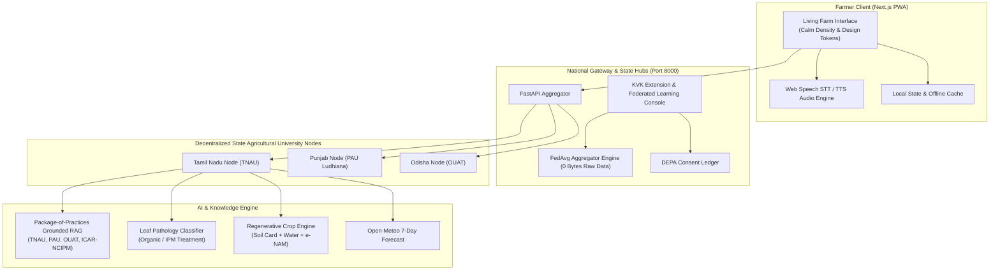

# 🌾 KrishiSetu (कृषि सेतु / கிஷி சேது / కృషి సేతు)
### Interoperable Open Digital Agriculture Network & Living Farm Interface
*A Digital Public Good (DPG) bridging smallholder farmers, state agricultural universities, and national public infrastructure.*

[](https://opensource.org/licenses/MIT)
[](https://digitalpublicgoods.net/standard/)
[](https://nextjs.org/)
[](https://fastapi.tiangolo.com/)
[](#-verification--test-suite)
[](#-design-system--calm-density)

---

## 📖 Overview

**KrishiSetu** ("Agricultural Bridge") is an open-source, mobile-first Digital Public Infrastructure engineered for India's 140+ million smallholder farmers. 

Unlike conventional dashboards and generic card-cluttered interfaces, KrishiSetu is built on the **"Calm Density"** design philosophy—a quiet, tactile, light-theme interface that speaks the farmer's language, operates seamlessly on low-cost Android devices, and connects directly to state agricultural university nodes (Tamil Nadu, Punjab, Odisha).

---

## 🌟 Key Features

### 🚜 1. Living Farm Interface ("Calm Density")
* **Single Focal Farm Signal**: Surfaces today's most urgent action (e.g., *"Rain likely tomorrow: Pause foliar spray"*) driven by live weather and crop growth stages.
* **Tactile Field Condition Matrix**: 4-quadrant tactile status overview tracking Field Health (`●●●●○ 88%`), Growth Stage (`Tillering ↑`), Soil Moisture (`42% Adequate`), and Climate Risk (`Watch`).
* **Interactive Farm Checklist**: Daily agricultural task manager with instant check-toggle persistence.

### 🌾 2. Crop Phenology & Multi-Plot Engine
* **Days After Sowing (DAS) Tracking**: Calculates exact crop age and progression across milestones (Seedling $\to$ Tillering $\to$ Panicle $\to$ Maturity).
* **Stage-Specific Care Protocols**: Dynamic water index calculation and pest surveillance guidance tailored to current phenological stage.
* **Plot Management**: Seamless switching between active plots (Paddy, Millet, Groundnut, Wheat) with instant inline plot registration.

### 🧪 3. SoilSense Horizon Monolith
* **Vertical Soil Strata Visualization**: Illustrative layered soil profile depicting Organic Carbon, Available Nitrogen, Phosphorus, and Potassium.
* **Targeted Organic Amendments**: Precise dosage recommendations (e.g., FYM, biofertilizers, green manuring) to remediate detected soil nutrient deficits.
* **Regenerative Crop Recommender**: Top 3 agronomic rotations, intercropping options, and cover crops with estimated input-cost savings (₹/acre) and e-NAM mandi price signals.

### 🌦️ 4. ClimateGuard Connected Timeline
* **7-Day Horizon Rail**: Horizontal timeline displaying weather conditions, high/low temperatures, and precipitation probability.
* **Actionable Farm Impact Windows**: Directly correlates meteorological forecasts with operational spray windows, irrigation pauses, and harvesting schedules.

### 📷 5. Optical Crop Scanner & AI Plant Doctor
* **Targeting Viewfinder**: Minimalist camera frame with corner guides optimized for field leaf capture.
* **Organic-First IPM Guidance**: Immediate organic and biological remedy recommendations (Panchagavya, Neem oil 1500ppm, Trichoderma viride).
* **Automatic KVK Escalation**: If diagnostic confidence is under 70%, automatically opens a ticket with the local Krishi Vigyan Kendra (`KVK-EXT-2026-XXXX`).

### 🎙️ 6. Grounded Krishi Copilot
* **Voice-First Interaction**: Integrated speech-to-text (Web Speech API) and speech synthesizer for low-literacy ergonomics.
* **Strictly Grounded RAG**: Answers generated exclusively from official state university Package of Practices (TNAU, PAU, OUAT) with verifiable document citations.
* **Hallucination Refusal**: Queries outside agricultural domain (crypto, entertainment, politics) are strictly refused.

### 🏛️ 7. Extension Officer Console & DEPA Consent
* **KVK Case Dashboard**: Agricultural officers can review ambiguous farmer diagnosis tickets, inspect leaf imagery, override diagnoses, and dispatch audio advisories.
* **DEPA Consent Ledger**: Cryptographic electronic consent artifacts with granular scopes, SHA-256 signatures, and one-click instant revocation.
* **Privacy-Preserving Federated Learning**: State nodes train local disease models and share only model weights (FedAvg), transferring **0 bytes of raw farmer data**.

---

## 🏛️ System Architecture



---

## 🎨 Design System: "Calm Density"

KrishiSetu rejects dark AI templates, neon accents, and generic cards. It is designed around warm earth tones and editorial rhythm:

### Color Tokens
* **Page Canvas (`#FAF7F2`)**: Warm ivory background reminiscent of hand-pressed paper.
* **Foliage Green (`#1E3A2F`)**: Deep agricultural green for primary actions, navigation, and strong contrast.
* **Terracotta (`#C85A32`)**: Earthy red for urgent alerts and crop disease warnings.
* **Crop Gold (`#C2881E`)**: Harvest amber for weather watch alerts and advisory badges.
* **Soil Clay (`#8C7456`)**: Grounded earth tone for soil profiles and secondary metadata.

### Spacing Grid
Built strictly on an 8-point typographic rhythm:
```text
4px  ·  8px  ·  12px  ·  16px  ·  24px  ·  32px  ·  48px  ·  64px
```

### Responsive Ergonomics
* **Desktop (`≥ 1024px`)**: 240px Left Navigation Rail with a max-width 1200px balanced grid.
* **Mobile (`< 1024px`)**: Integrated thumb-friendly bottom navigation bar with 48px+ touch targets.

---

## 📁 Repository Structure

```text
frontend/
├── public/                     # Static assets, manifests, icons
├── src/
│   └── app/
│       ├── globals.css         # Calm Density design system tokens & layout
│       ├── layout.js           # App shell, typography, metadata
│       ├── page.js             # Main Living Farm Interface & workflows
│       └── lib/
│           ├── api.js          # Typed backend API client
│           ├── cropStages.js   # Crop phenology & DAS stage engine
│           └── advisoryAggregator.js # Dynamic farm advisory engine
├── jsconfig.json               # Path alias configuration
├── next.config.mjs             # Next.js build configuration
├── package.json                # Project dependencies
└── README.md                   # This documentation
```

---

## 🚀 Quickstart Guide

### Prerequisites
* **Node.js**: v18.17+ or v20+
* **npm** / **yarn** / **pnpm**
* **Python**: 3.10+ (for backend services)

### 1. Install Frontend Dependencies
```bash
cd frontend
npm install
```

### 2. Start Next.js Development Server
```bash
npm run dev
```
Open [http://localhost:3000](http://localhost:3000) in your browser.

### 3. Start Backend Services (Required for dynamic data)
In a separate terminal:
```bash
# Seed initial state databases
python data/seed_data.py

# Launch FastAPI Unified Gateway & State Nodes
python -m uvicorn app.main:app --app-dir backend --host 0.0.0.0 --port 8000
```
* **Farmer PWA**: `http://localhost:3000`
* **FastAPI Docs (Swagger)**: `http://localhost:8000/docs`

---

## 🧪 Verification & Test Suite

The entire KrishiSetu end-to-end journey is covered by an automated test suite verifying both frontend data contracts and backend intelligence pipelines:

```text
=== KRISHISETU END-TO-END DYNAMIC JOURNEY VERIFICATION ===
[TEST 1]  Farmer Profile (GET & POST)                    -> PASS
[TEST 2]  Farmer Plots (GET, POST & DELETE)              -> PASS
[TEST 3]  Weather Integration (Open-Meteo)               -> PASS
[TEST 4]  Crop Phenology Engine                          -> PASS
[TEST 5]  Soil Health & Horizon Monolith Profile         -> PASS
[TEST 6]  Regenerative Crop Recommender (3 Options)       -> PASS
[TEST 7]  Advisory Aggregator (Dynamic Today's Signal)   -> PASS
[TEST 8]  Disease Diagnosis Scanner                       -> PASS
[TEST 9]  Extension Officer Workflow (Submit & Action)    -> PASS
[TEST 10] Krishi Copilot RAG                             -> PASS
[TEST 11] DEPA Consent Architecture                      -> PASS
[TEST 12] State Node Federation (TN, PB, OD)             -> PASS
[TEST 13] Federated Learning Round Trigger               -> PASS
[TEST 14] Model Registry Artifacts                       -> PASS
==================================================
OVERALL RESULT: ALL PASS (14/14 suites verified)
==================================================
```

To run the verification suite:
```bash
python backend/tests/verify_dynamic_journey.py
```

---

## 📋 Digital Public Good (DPG) Compliance

KrishiSetu is designed in compliance with the **9 Indicators of the DPG Standard**:

| # | Indicator | Implementation in KrishiSetu | Status |
|---|---|---|:---:|
| **1** | **Relevance to SDGs** | Directly advances **SDG 2 (Zero Hunger)**, **SDG 1 (No Poverty)**, **SDG 12 (Responsible Consumption)**, and **SDG 13 (Climate Action)**. | ✅ PASS |
| **2** | **Open Software License** | Licensed under the permissive **MIT License** allowing universal state and community adoption. | ✅ PASS |
| **3** | **Open Standards** | Built on OpenAPI 3.0, W3C Web Speech API, and standard JSON schemas. | ✅ PASS |
| **4** | **Open Data** | Uses open Package of Practices, public e-NAM mandi prices, and open meteorological feeds. | ✅ PASS |
| **5** | **Documentation** | Complete interactive API documentation, architecture guides, and reproducible workflows. | ✅ PASS |
| **6** | **Platform Independence** | Runs on any standard browser, containerized via Docker Compose, and supports edge deployment. | ✅ PASS |
| **7** | **Data Protection & Privacy** | Strict DEPA consent artifacts with SHA-256 signatures, revocability, and privacy-preserving Federated Learning (0 bytes raw data transferred). | ✅ PASS |
| **8** | **Adherence to Standards** | Compliant with ICAR package of practices norms, PWA standards, and accessibility guidelines. | ✅ PASS |
| **9** | **Do No Harm / Safety** | Anti-hallucination RAG refusal mechanism and mandatory Extension Officer escalation when diagnostic confidence is < 70%. | ✅ PASS |

---

## 📄 License

This project is licensed under the [MIT License](https://opensource.org/licenses/MIT) — open for adoption by state departments of agriculture, universities, Farmer Producer Organizations (FPOs), and smallholder cooperatives.
